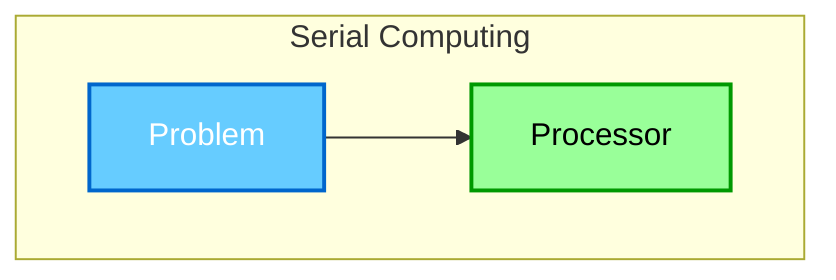
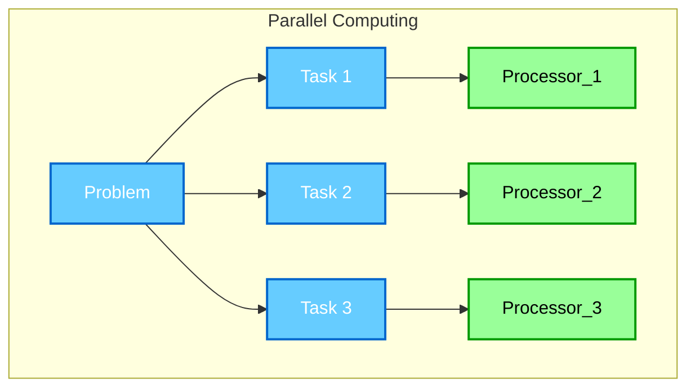
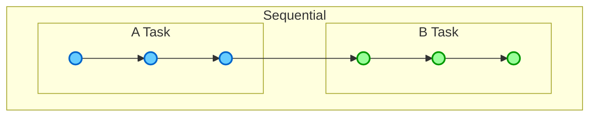
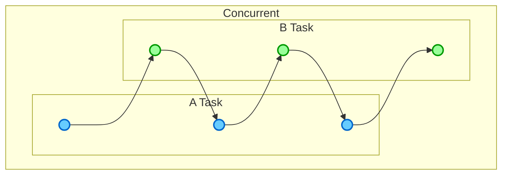
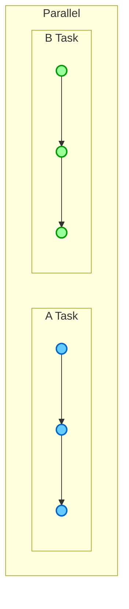

## 병렬 컴퓨팅(Parallel Computing) 이란?

병렬 컴퓨팅이란 계산법 혹은 컴퓨터 활용(computation) 의 한 종류이다. 즉 컴퓨터의 컴퓨팅 파워를 잘 활용하기 위한 벙법의 하나이며 이는 많은 연산, 혹은 프로세서를 동시에 처리하는 것을 의미한다. 이는 큰 문제를 작고 독립적인 여러개의 작업으로 나누어 각각의 작업이 동시에 여러 프로세서로 실행 시키는 것을 포함한다. 이를 그림으로 비교하면 다음과 같다.

그러면 이러한 병렬 컴퓨팅은 왜 필요할까? 이는 크게 4가지를 예시로 살펴 볼 수 있다.
- 성능 향상(Enhanced Performance)
  : 매운 큰 문제를 작은 여로 개의 작업으로 나누어 동시에 처리하기에 처리 속도가 크게 향상될 수 있다.
- 매우 큰 데이터의 처리 (Big Data Processing)
  : 매우 크고 무거운 데이터 집합을 처리할 때 효율적으로 처리할 수 있다.
- 자원의 효율화 (Resource Optimization)
  : 이는 비교적 저렴한 프로세서를 사용하여 고가의 단일 프로세서와 동등한 성능을 낼 수 있다. 또한 기존의 하드웨어를 활용하여 추가 구매 비용을 절약할 수 있으며 여로 프로세서에 작업을 분산시켜 각 프로세서의 부하를 줄일 수 있다.
- 현실 세계를 모델링할 때(Real-World Modeling)
  : 교통이나 날씨 경제 등의 현실 데이터를 분설 할 때 방대한 양의 연산을 작은 작업으로 나누어 처리하여 성능을 높일 수 있다.

예시로 비디오 게임의 경우 병렬 컴퓨팅을 통해 현실 세계와 비슷하거나 과거에 비해 비약적으로 향상된 그래픽을 구현해 냈으며 과학, 경제 등의 시뮬레이션 또한 이러한 병렬 컴퓨팅을 통하여 더 빠르고 정확한 시뮬레이션을 가능하게 되었다.

## 병렬 처리 (Parallelism) vs. 동시성 (Concurrency)

아무래도 둘이 비슷한 느낌의 표현이기에 혼용될 수 있을 것이다. 다만 둘은 엄연히 다른 뜻을 지닌다.
- 병렬 처리 (Parallelism)
  : 병렬 처리란 동시에 여러 개의 작업을 수행하는 것이다.
- 동시성 (Concurrency)
  : 동시성은 동시에 여러 작업을 다루는 것으로 병렬 처리와 유사해 보이지만 동시에 실행될 필요는 없다. 즉 여러 작업이 동시에 다루는 것처럼 보이지만 실질적으로 동시에 실행되지 않을 수 있다는 것이다.

