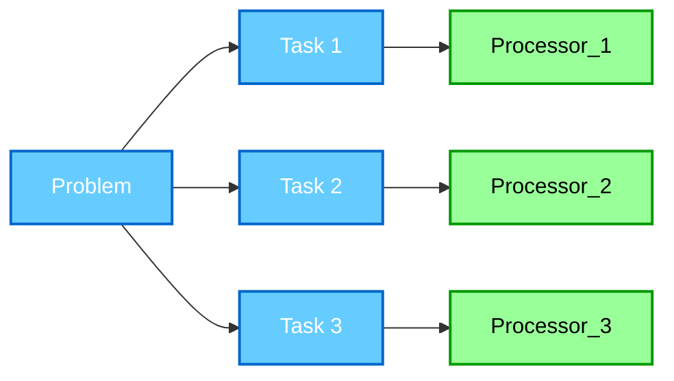
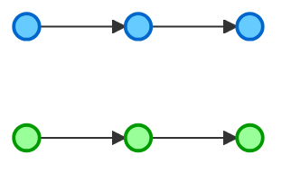
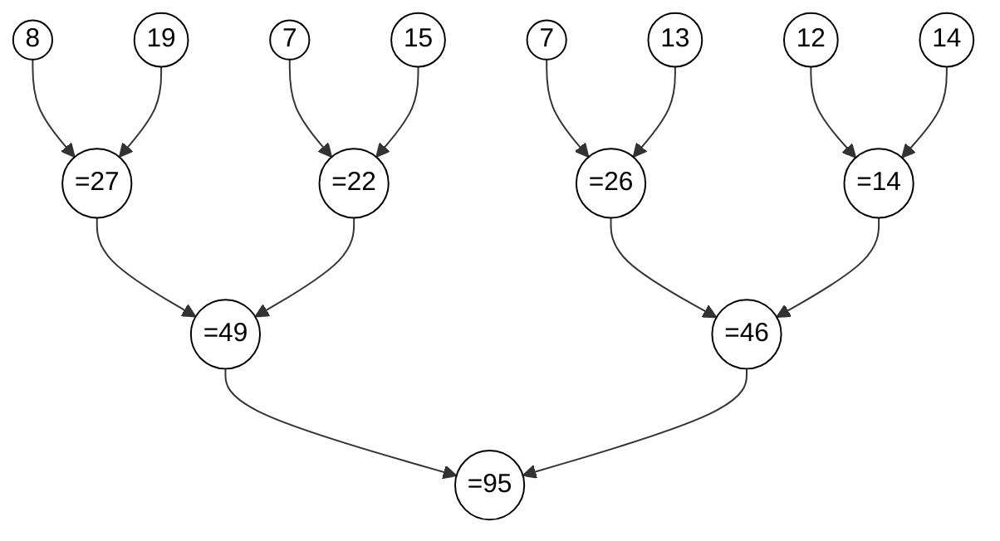

## 병렬 컴퓨팅(Parallel Computing) 이란?

병렬 컴퓨팅이란 계산법 혹은 컴퓨터 활용(computation) 의 한 종류이다. 즉 컴퓨터의 컴퓨팅 파워를 잘 활용하기 위한 벙법의 하나이며 이는 많은 연산, 혹은 프로세서를 동시에 처리하는 것을 의미한다. 이는 큰 문제를 작고 독립적인 여러개의 작업으로 나누어 각각의 작업이 동시에 여러 프로세서로 실행 시키는 것을 포함한다. 이를 그림으로 비교하면 다음과 같다.

<center>Serial Computing</center>


<center>Parallel Computing</center>



그러면 이러한 병렬 컴퓨팅은 왜 필요할까? 이는 크게 4가지를 예시로 살펴 볼 수 있다.
- 성능 향상(Enhanced Performance)
  : 매운 큰 문제를 작은 여로 개의 작업으로 나누어 동시에 처리하기에 처리 속도가 크게 향상될 수 있다.
- 매우 큰 데이터의 처리 (Big Data Processing)
  : 매우 크고 무거운 데이터 집합을 처리할 때 효율적으로 처리할 수 있다.
- 자원의 효율화 (Resource Optimization)
  : 이는 비교적 저렴한 프로세서를 사용하여 고가의 단일 프로세서와 동등한 성능을 낼 수 있다. 또한 기존의 하드웨어를 활용하여 추가 구매 비용을 절약할 수 있으며 여로 프로세서에 작업을 분산시켜 각 프로세서의 부하를 줄일 수 있다.
- 현실 세계를 모델링할 때(Real-World Modeling)
  : 교통이나 날씨 경제 등의 현실 데이터를 분설 할 때 방대한 양의 연산을 작은 작업으로 나누어 처리하여 성능을 높일 수 있다.

예시로 비디오 게임의 경우 병렬 컴퓨팅을 통해 현실 세계와 비슷하거나 과거에 비해 비약적으로 향상된 그래픽을 구현해 냈으며 과학, 경제 등의 시뮬레이션 또한 이러한 병렬 컴퓨팅을 통하여 더 빠르고 정확한 시뮬레이션을 가능하게 되었다.

## 병렬 처리 (Parallelism) vs. 동시성 (Concurrency)

아무래도 둘이 비슷한 느낌의 표현이기에 혼용될 수 있을 것이다. 다만 둘은 엄연히 다른 뜻을 지닌다.
- 병렬 처리 (Parallelism)
  : 병렬 처리란 동시에 여러 개의 작업을 수행하는 것이다.
- 동시성 (Concurrency)
  : 동시성은 동시에 여러 작업을 다루는 것으로 병렬 처리와 유사해 보이지만 동시에 실행될 필요는 없다. 즉 여러 작업이 동시에 다루는 것처럼 보이지만 실질적으로 동시에 실행되지 않을 수 있다는 것이다.

이때 녹색의 노드를 task 1, 파란 노드를 task 2 라고 하면 각각은 다음과 같이 표현될 수 있다.

<center>Sequential</center>


<center>Concurrent</center>


<center>Parallel</center>



## 병렬 컴퓨팅의 종류 (Types of Parallel Computing)

병렬 컴퓨팅의 대표적인 4개의 종류는 다음과 같다.

- Bit-level Parallelism
- Instruction-level Parallelism
- Task Parallelism
- Data Parallelism

각각의 병렬 컴퓨팅 방법에 대해 간략하게 알아보면 다음과 같다.

1. Bit-level Parallelism
   
   Bit-level Parallelism은 프로세서(processor)의 워드(word), 즉 프로세서가 사용하는 기본적인 단위(명령어, 혹은 데이터 등의 길이)를 늘려 수행에 필요한 명령어의 수를 줄이는 병렬 컴퓨팅 기법이다. 이는 하드웨어 단에서 구현되며, 이를 통하여 소프트웨어를 크게 수정 하지 않고 성능 향상을 기대해 볼 수 있다. 우리가 아는 대표적인 예시는 현재의 프로세서가 과거의 32-bit 프로세서에서 64-bit 프로세서로 바뀐 것이다. 이를 통하여 우리는 큰 데이터에 대한 처리가 향상되었다. 또한 [FPGA](https://ko.wikipedia.org/wiki/FPGA) 또한 하나의 예시이다.   
   다만 이러한 Bit-level Parallelism은 하드웨어의 복잡하게 만들 수 있으며 워드의 크기를 단순히 늘리는 것 만드는 성능 향상이 유의미하지 않을 가능성이 크며 오히려 전력 사용만 늘려 득이 줄 수 있다. 또한 기종 소프트웨어와 호환성 문제가 생길 수 있다.

2. Instruction-level Parallelism
   
   Instruction-level Parallelism은 여러 명령어를 프로세서에서 동시에 실행시키는 것이다. 이러한 Instruction-level Parallelism의 핵심은 컴퓨터 구조에서 배웠던 것들로 다음과 같다.   

   - [Pipelining](https://ko.wikipedia.org/wiki/%EB%AA%85%EB%A0%B9%EC%96%B4_%ED%8C%8C%EC%9D%B4%ED%94%84%EB%9D%BC%EC%9D%B8)
   - [Superscalar Architecture](https://ko.wikipedia.org/wiki/%EC%8A%88%ED%8D%BC%EC%8A%A4%EC%B9%BC%EB%9D%BC)
   - [Out-of-Order Execution](https://ko.wikipedia.org/wiki/%EB%B9%84%EC%88%9C%EC%B0%A8%EC%A0%81_%EB%AA%85%EB%A0%B9%EC%96%B4_%EC%B2%98%EB%A6%AC)
   - [Branch Prediction](https://ko.wikipedia.org/wiki/%EB%B6%84%EA%B8%B0_%EC%98%88%EC%B8%A1)
   - [Register Renaming](https://ko.wikipedia.org/wiki/%EB%A0%88%EC%A7%80%EC%8A%A4%ED%84%B0_%EC%9D%B4%EB%A6%84_%EB%B3%80%EA%B2%BD)
  
3. Task Parallelism
   
   Task Parallelism은 여러 처리 장치(processing unit)에 서로 다른 작업(task)들을 분산시켜 동시에 실행시키는 것이다. 이는 하나의 작업을 여러 작업으로 나누어 실행하기보단 <u>완전히 다른 작업을 서로 다른 프로세서나 스레드(thread)에 할당하는 것</u>이다.
   
   예시로는 다음이 있다.
   - Web browser
      - 하나의 스레드가 웹페이지를 렌더링한다.
      - 다른 스레드는 사용자의 입력을 다룬다.
      - 또 다른 스레드는 미디어(media)를 다운로드 한다.
   
   이러한 Task Parallelism은 각각의 작업 간의 의존(Dependency) 문제가 발생할 수 있으며 Load Balancing Problems, 즉 일부 프로세서 혹은 스레드는 과부하 되지만 다른 프로세서 혹은 스레드는 유휴 상태가 될 수 있다. 또한 작업이 끝나 다시 동기화(Synchronization)할 때 오버헤드(overhead)가 발생할 수 있다.
  
4. Data Parallelism

   Data Parallelism은 여러 조각의 데이터에 대해 동일한 연산을 여러 처리 장치(processing unit)을 사용하여 처리하는 것이다.

   예시로는 다음이 있다.
   - Vectorized computation
   - Image processing
   - ...
  
   다만 연속적으로 이뤄져야 하는 작업 즉 이전 작업의 결과에 의존하는 작업의 경우 그리 효과적이지 않으며, 또한 Load Balancing Problems 가 생길 수 있다.

## 무어의 법칙 (Moore's Law)

무머의 법칙은 마이크로칩(microchip)에 있는 트랜지스터(transistor)의 수가 2년마다 대략 2배씩 증가하는 것을 말한다. 이는 1965년 intel의 공동 창업자인 [Gordon Moore](https://ko.wikipedia.org/wiki/%EA%B3%A0%EB%93%A0_%EB%AC%B4%EC%96%B4)가 관측하여 만든 것이다. 다만 반드시 그런 것은 아니며 조금씩 수정되기도 한다.

다만 [양자 터널링(Quantum tunneling)](https://ko.wikipedia.org/wiki/%ED%84%B0%EB%84%90_%ED%9A%A8%EA%B3%BC)이나 발열의 문제가 있으며, 제조 과정에서 드는 돈이 증가한다는 문제 또한 있다. 지금은 하나의 프로세서에 더 많은 트랜지스터를 넣기보다 [Multi-core processing](https://ko.wikipedia.org/wiki/%EB%A9%80%ED%8B%B0_%EC%BD%94%EC%96%B4)을 통하여 성능을 향상하는 대안이 주로 사용된다.

## 플린 분류 (Flynn's Taxonomy)

플린 분류는 컴퓨터 구조(computer architecture)를 명령어와 데이터가 어떻게 병렬 처리되는지를 통한 분류법이다. 이는 1966년 [Michael J. Flynn](https://en.wikipedia.org/wiki/Michael_J._Flynn)에 의해 소개되었다. 이는 다음과 같이 4가지로 컴퓨터 구조를 구분하였다.


이에 대하여 각각의 컴퓨터 구조가 어떤 것인지 알아 볼 것이다.

1. SISD

   이는 Single Instruction, Single Data의 약자로 단일 메모리에 저장된 데이터에 대해   하나의 프로세서가 하나의 명령어를 처리함을 의미한다. [폰 노이만 구조(Von Neumann computer)](https://ko.wikipedia.org/wiki/%ED%8F%B0_%EB%85%B8%EC%9D%B4%EB%A7%8C_%EA%B5%AC%EC%A1%B0) 의 컴퓨터, 즉 [단일 프로세서(uniprocessor)](https://en.wikipedia.org/wiki/Uniprocessor_system)가 SISD에 속한다. 현대의 CPU는 대부분 [멀티코어(multicore)](https://ko.wikipedia.org/wiki/%EB%A9%80%ED%8B%B0_%EC%BD%94%EC%96%B4) 프로세서지만 싱글 코어 프로세서만이 SISD로 여겨진다.

2. SIMD

   이는 Single Instruction, Multiple Data의 약자로 하나의 명령어가 여러 처리 요소의 동시 실행(simultaneous execution)을 락스텝 방식(lockstep basis)으로 제어한다. 이때 락스텝 방식이란 여러 처리 요소가 완전히 동기화 되어 동시에 같은 작업을 수행하는 방식이다. 즉 SIMD는 여러 데이터에 대하여 동일한 연산을 수행하며 모든 처리 요소가 동기화되어 같은 시점에 같은 작업을 수행한다.
   
   SIMD는 Data parallelism의 한 종류다. 이러한 SIMD 프로세서로 [Vector processors](https://ko.wikipedia.org/wiki/%EB%B2%A1%ED%84%B0_%ED%94%84%EB%A1%9C%EC%84%B8%EC%84%9C)가 최초로 나왔다. 응용프로그램으로는 Image processing, Matrix manipulation이 있다.

3. MISD
   
   이는 Multiple Instruction, Single Data의 약자로 데이터 시퀀스가 서로 다른 명령어 시퀀스를 실행하는 여러 프로세스로 전달되는 것을 말한다. 즉 여러 프로세서가 동시에 다른 작업을 수행하며 각 프로세서는 같은 데이터에 대해 다른 연산을 수행 할 수 있다. 이러한 구조의 프로세서는 상업적으로 구현되지는 않았지만, 국방이나 항공 우주 산업(aerospace)과 같이 fault tolerance가 필요한, 즉 결함에 대해 민감하거나 로봇 비전과 같이 입력 데이터에 대해 다양한 처리를 하는 분야에 대해서는 유용할 것이다. 이와 같이 비록 상업적으로 잘 구현되지는 않지만 특별한 일을 위한 종류(specialized nature)에 대해선 유요할 수 있다.

4. MIMD

   이는 Multiple Instruction, Multiple Data의 약자로 여러 프로세서가 각기 다른 명령어 시퀀스로 각자에게 주어진 데이터 세트을 처리하는 방식이다. 즉 이는 여러 개의 프로세서가 동시에 작동하트 것과 유사하며 각 프로세서가 서로 다른 데이터를 처리하는 방식을 의미한다. MIMD는 병렬 아키텍처(Parallel Architecture)중 가장 흔하고 널리 사용되는 방식이며 각각의 범용 프로세서(general-purpose processor)는 필요한 모든 명령어를 처리할 수 있다.   

   또한 이러한 MIMD는 메모리 구성(memory arrangement)에 따라 두 개로 나뉠 수 있다.
   - Shared Memory   
  
     

     공유 메모리 시스템(Shared Memory system)에는 병렬 아키텍쳐 중의 하나로 여러  프로세서가 하나의 전역 메모리 공간(global memory space)을 공유하는 것이다. 해당 메모리 구성은 데이터 공유가 암묵적(implicit, communication이 필요하지 않은)이며 비교적 빠르다. 다만 메모리 접근에 대한 충돌(conflict)이나 동기화 문제(synchronization)을 처리하는 복잡한 구조를 필요로한다. 또한 메모리 경합(memory contention)에 의해 성능이 저하 될 수 있으며 이에 따라 확장성(scalability)이 제한될 수 있다. 예시로는 현대의 Multi-core CPU와 GPU architecture(부분적으로)가 있다.

   - Distributed Memory   
     
     

     분산 메모리 시스템(Distributed Memory system) 각자 고유의 메모리를 갖는 여러 프로세서로 이루어진 것을 의미한다. 각 프로세서는 네트워크를 통해 메시지를 보내는 식을 통하여 다른 프로세서와 소통한다. 해당 메모리 구성은 명시적인 소통이 필요하다. 즉 네트워크를 통해 직접 데이터를 주거 받아야 하며 이에 따라 전송 지연(latency)이 발생하여 통신 오버헤드가 발생한다. 다만 확장성이 뛰어나며 하나의 노드가 고장 나더라도 다른 노드들은 정상 작동하기에 장애 허용성(Fault-tolerant), 즉 안정성이 좋다. 예시로는 [Cluster computing](https://ko.wikipedia.org/wiki/%EC%BB%B4%ED%93%A8%ED%84%B0_%ED%81%B4%EB%9F%AC%EC%8A%A4%ED%84%B0)(e.g., Google Cloud, AWS, ...) 이나 [Supercomputers](https://ko.wikipedia.org/wiki/%EC%8A%88%ED%8D%BC%EC%BB%B4%ED%93%A8%ED%84%B0)(e.g., IBM Summit, Fugaku, ..) 등이 있다.

## 병렬 컴퓨팅의 비결정성 (Non-determinism in Parallel Computing)

병렬 컴퓨팅에 있어 비결정성(Non-determinism)은 동일한 입력에 대해서도 실행할 때마다 다른 결과가 나오는 현상(phenomenon)을 뜻한다.
```cpp
#include <iostream>
#include <thread>

using namespace std;

int main(){
   thread t1 ([]() {cout << "Thread 1" << endl;});
   thread t2 ([]() {cout << "Thread 2" << endl;});

   t1.join();
   t2.join();

   return 0;
}
```

위의 코드는 단순히 각자 다른 문자열을 출력하는 스레드를 생성하는 코드이다. 이때 위와 같은 코드에서 Thread 1이 먼저 출력될지 혹은 Thread 2가 먼저 출력될지는 알 수 없다. 따라서 동일한 환경에 대해 동일한 입력에 대해서도 때마다 다른 결과가 나올 수 있어 주의해야 한다.

또한 경합 조건(Race condition)이 발생할 수도 있다. 이는 동시성(concurrency) 문제로 여러 스레드 혹은 프로세서가 하나의 공유 중인 데이터를 동시에 수정할 때 생기는 문제이다. 이 또한 매 실행 결과가 다르며 심지어 예측할 수 없고, 잘못된 동작을 하게 된다.

```cpp
#include <iostream>
#include <thread>

using namespace std;

int shared_counter = 0;

void increase_counter(){
   for(int i = 0; i <1000000; i++){
      shared_counter++;
   }
}

int main(){
   thread t1 (increase_counter);
   thread t2 (increase_counter);

   t1.join();
   t2.join();

   cout << "Result: " << shared_counter << endl;

   return 0;
}
```

위의 코드에서 알 수 있듯 10번 라인에서 경합 조건이 발생하여 잘못된 결과가 출력될 것을 예상할 수 있다.

## 병렬 컴퓨팅의 성능 (Performance of Parallel Computing)

그렇다면 설계한 병렬 컴퓨팅, 혹은 병렬 컴퓨팅을 활용한 기술을 테스트할 때 어떠한 지표를 활용할 수 있을까? 이때 우리는 스피드업(Speed up, $$S$$)와 효율(Efficiency, $$E$$)을 생각해 볼 수 있다. 각각은 다음과 같다.

- 스피드업(Speed up, $$S$$)
  
  이는 단일 프로세서 시스템에 비해 구현된 병렬 시스템이 얼마나 더 빨라졌는지에 대한 비율이다. 기존의 단일 프로세서의 실행 시간을 $$T_1$$이라 하고 병렬 시스템의 실행 시간을 $$T_p$$라고 할 때, 스피드업 $$S$$는 다음과 같다.

  $$S=\frac{T_1}{T_p}$$

  만약 단일 프로세서가 작업을 수행하는데 $$10s$$가 걸렸고, 5개의 프로세서로 구성된 병렬 시스템이 동일한 작업을 수행하는데 $$2s$$가 걸렸다면, 이때 스피드업은 다음과 같다.

  $$S=\frac{T_1}{T_p}=\frac{10s}{2s}=5$$

  따라서 해당 예제에서는 단일 프로세서보다 5개의 프로세서로 구성된 병렬 시스템이 5배 빠르다.

- 효율(Efficiency, $$E$$)
  
  이는 병렬 컴퓨팅 시스템을 구성한 여러 프로세서가 얼마나 효율적으로 사용되었는지를 살펴볼 수 있는 지표이다. 동일하게 스피드업을 $$S$$, 단일 프로세서의 실행 시간을 $$T_1$$이라 하고 병렬 시스템의 실행 시간을 $$T_p$$라고 하자. 그리고 여기에 병렬 시스템을 구성하는 프로세서의 수 $$p$$를 추가하여 효율 $$E$$을 다음과 같이 표현할 수 있다.

  $$E=\frac{S}{p}=\frac{T_1}{p T_p}$$

  만약 이때 E가 1이면, 즉 모든 프로세서가 완전히 활용되었다면 이때를 <u>완전한 효율성(Perfect Efficiency)</u> 라고 하며, 만약 1보다 작으면 몇몇 프로세서가 Idle, 즉 쉬고 있거나 오버헤드가 일어났다는 것을 의미한다.

실제로 병렬 컴퓨팅을 하면 얼마나 실행시간을 줄일 수 있을까? 앞서 말한 완전한 효율성, 즉 Perfect Efficiency는 작업이 병렬적으로 균등하게 분배되고, 추가적인 오버헤드(통신 비용, 동기화 문제 등)가 전혀 없는 이상적인 상황을 의미한다. 즉, 사실상 우리가 현실에서 보기 힘든 상황이라는 것이다. 현실 이러한 이상적인 병렬 컴퓨팅은 통신 오버헤드, 메모리 대역폭 재한, 로드 불균형(Load Imbalance), 동기화 비용(Synchronization Cost) 등이 존재하기에 만들어지기 어렵다고 볼 수 있다.

이러한 예시중 병렬 컴퓨팅을 통하여 3D 표면 텍스쳐를 편집할때 병렬 컴퓨팅을 통한 결과 표이다.

[Parallel 3D Images Surface Texture Editing , by Ye Chen, Ren Zhikao, Ye Qian](https://www.sciencedirect.com/science/article/pii/S1877705811020522)

| Process number P | Running time (s)  | Acceleration ratio \( S_P \) | Parallel efficiency \( f_P \) |
| ---------------- | ----------------- | ---------------------------- | ----------------------------- |
| 1                | \( T_s = 14.88 \) | /                            | /                             |
| 2                | 10.86             | 1.37                         | 0.685                         |
| 3                | 8.07              | 1.84                         | 0.61                          |
| 4                | 5.19              | 2.86                         | 0.72                          |
| 5                | 4.23              | 3.52                         | 0.70                          |
| 6                | 3.30              | 4.51                         | 0.75                          |
| 7                | 2.94              | 5.06                         | 0.72                          |
| 8                | 2.58              | 5.77                         | 0.72                          |

이를 통하여 알 수 있듯이 수행 시간을 줄고, 스피드업($$S_p$$)늘어 성능은 좋아졌지만, 효율($$f_P$$)를 확인하면 프로세서의 수가 6개일 때 최대이고 이후 다시 주는 것을 확인할 수 있다. 이처럼 단순히 프로세서를 늘리는 것이 성능을 높일 수 있지만 효율은 오히려 낮아질 수 있음을 의미한다.

## 암달의 법칙 (Amdahl's Law)

암달의 법칙은 완전한 효율성을 바탕으로 하며 시스템의 특정 부분을 향상시켜 최대로 얼마나 전체를 향상할 수 있는가에 대한 법칙이다. 여기서 특정 부분은 병렬화가 가능한 부분으로 만일 무한한 프로세서로 구성된 시스템에선 이러한 부분에 대한 실행 시간은 $$0$$에 수렴하여 순차적인, 즉 병렬화하기 힘들거나 할 수 없는 부분만 남길 수 있다. 암달의 법칙은 $$p$$개의 프로세서(혹은 코어, 스레드)를 통하여 병렬화가 가능한 부분의 비율 $$0\geq P \leq1$$에 스피드업 $$S(p)$$로 다음과 같이 표현될 수 있다.

$$S(p)=\frac{1}{(1-P) + \frac{P}{p}}$$

예시로 프로그램의 $$95 \%$$가 반복되며 병렬화할 수 있다고 할 때 6개의 CPU로 실행시간이 최대로 얼마나 빨라질 수 있는지를 알고자 한다면 다음과 같다.

$$S(6) = \frac{1}{(1-P)+\frac{P}{p}} = \frac{1}{0.05 + \frac{0.95}{6}} = 4.8$$

따라서 $$95 \%$$가 반복되며 병렬화할 수 있다고 할 때 6개의 CPU로 실행시간이 최대로 $$4.8$$배 빨라질 수 있다.

## 병렬 컴퓨팅을 배우는 이유 (Naïve Parallel Algorithm vs Improved Algorithm)

단순한 병렬 알고리즘(Naïve Parallel Algorithm)은 말 그대로 특별한 기술 없이 단순하게 알고리즘을 구성한 것이다. 비교를 위하여 다음과 같이 알고리즘을 구현해보자. 총 24개의 데이터에 대하여 이를 모두 더하는 병렬 알고리즘을 설계한다고 했을 때 가장 단순하게 생각할 수 있는 것은 총 8개의 스레드를 만들어 각각 3개의 데이터를 더한 뒤 저장한다. 이후 메인 스레드에서 이를 모두 더한다. 이는 다음과 같이 동작할 것이다.

| Data Groups                    | 1,4,3 | 9,2,8 | 5,1,1 | 5,2,7 | 2,5,0 | 4,1,8 | 6,5,1 | 2,3,9 |
| ------------------------------ | ----- | ----- | ----- | ----- | ----- | ----- | ----- | ----- |
| **thread sum** $$\Rightarrow$$ | 8     | 19    | 7     | 15    | 7     | 13    | 12    | 14    |

| **main thread sum** $$\Rightarrow$$| 8 + 19 + 7 + 15 + 7 + 13 + 12 + 14 = **95** |

이러한 단순한 방식은 데이터세트의 크기가 커지면 결국 메인 스레드에서 다시 결과를 합칠 때 큰 부하와 너무 많은 스레드는 오히려 결과를 합치는데 더 큰 부하를 만들 것을 예상할 수 있다. 그렇다면 이러한 알고리즘을 개선하는 방법으론 무엇이 있을까? 

좀더 향상된 방법으로는 Tree 형태로 더 많은 스레드를 만들어 이러한 결과를 합치는 과정 또한 병렬화 하는 방법이 있을 것이다. 이는 결과를 합치는 과정을 여러 레벨로 나누어 위와같은 단순한 알고리즘을 최적화 한 것이다. 이를 그림으로 만들면 다음과 같다.



위의 그래프는 향상된 병렬 알고리즘의 흐름을 그린 것이다. 위를 통해 알 수 있듯 합치는 과정 또한 하위 레벨로 나누어 병렬화하였고, 이를 통하여 데이터세트의 크기가 커져도 괜찮은 성능 향상을 기대할 수 있다.

두 알고리즘을 비교하면 다음과 같다. 이때 데이터 세트의 크기 $$n = 3072$$이다.

- Naïve Parallel Algorithm
  
   | # of cores       | 8   | 16  | 32  | 64  | 128 | 256 | 512 | 1024 |
   | ---------------- | --- | --- | --- | --- | --- | --- | --- | ---- |
   | **Comp. values** | 384 | 192 | 96  | 48  | 24  | 12  | 6   | 3    |
   | **Summation**    | 7   | 15  | 31  | 63  | 127 | 255 | 511 | 1023 |
   | **Total time**   | 391 | 207 | 127 | 111 | 151 | 267 | 517 | 1026 |

- Improved Algorithm
  
   | # of cores       | 8   | 16  | 32  | 64  | 128 | 256 | 512 | 1024 |
   | ---------------- | --- | --- | --- | --- | --- | --- | --- | ---- |
   | **Comp. values** | 384 | 192 | 96  | 48  | 24  | 12  | 6   | 3    |
   | **Summation**    | 3   | 4   | 5   | 6   | 7   | 8   | 9   | 10   |
   | **Total time**   | 387 | 196 | 101 | 54  | 31  | 20  | 15  | 13   |


이처럼 향상된 알고리즘이 코어, 즉 작업을 시키는 스레드의 수를 늘렸을 때 유의미하게 큰 성능 향상을 보였다. 다만 단순한 병렬 알고리즘에서는 스레드의 수가 늘었을 때 오히려 성능 하락을 보인다.
