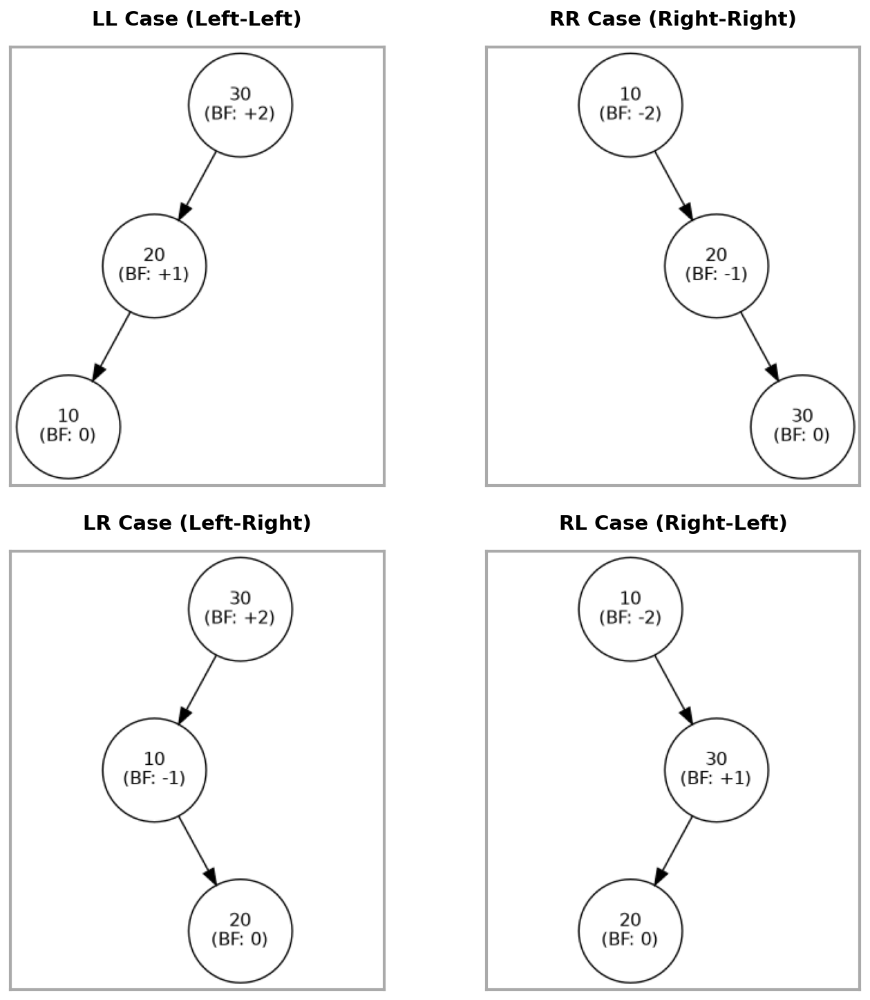
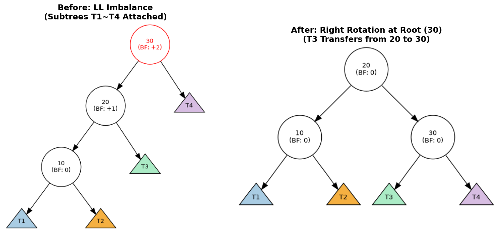
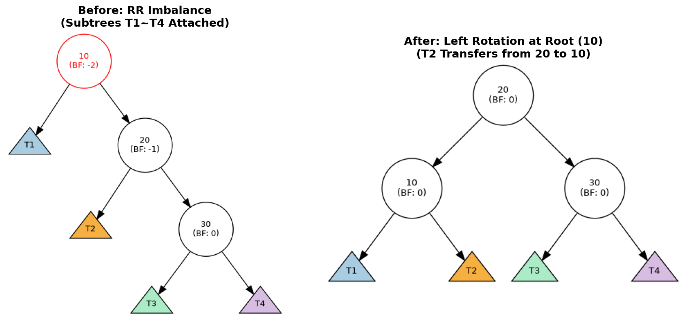
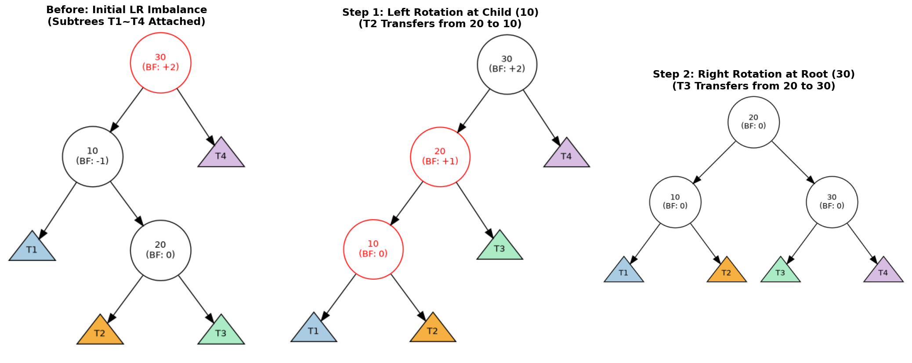
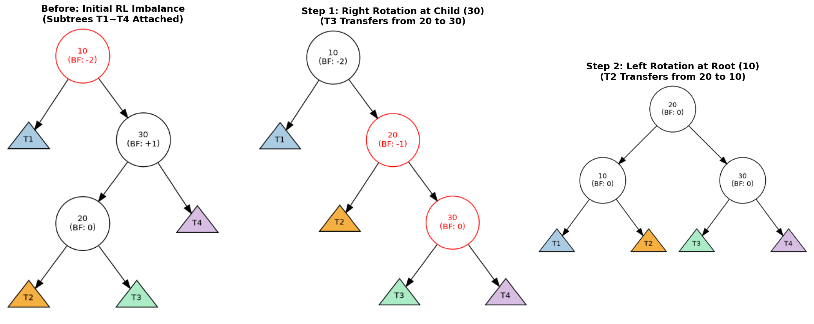

#+title: 자료구조
#+HUGO_BASE_DIR: ~/sangaje.github.io/
#+HUGO_SECTION: posts/Data_Structure
#+HUGO_CATEGORIES: 자료구조
#+HUGO_TAGS: 자료구조
#+HUGO_AUTO_EXPORT: t
# #+HUGO_DRAFT: true
#+OPTIONS: tex:t
#+OPTIONS: with-sub-superscripts:nil

* BST-AVL Tree (1) 기초 :Tree:BST:AVL_Tree:
:PROPERTIES:
:EXPORT_FILE_NAME: bst_avl_tree-1
:HUGO_DRAFT: flase
:END:
#+bibliography: ./shared/Reference/Data_Structure/BST.bib

** TODO
#+BEGIN_QUOTE
이번 글은 AVL Tree에 대한 기초적인 개념과 회전 연산에 대해 설명한다. AVL Tree는 자가 균형 이진 탐색 트리의 한 종류로, 각 노드의 왼쪽과 오른쪽 서브트리의 높이 차이가 최대 1이 되도록 유지하는 트리 구조이다. 삽입과 삭제 연산 후에도 균형을 유지하기 위해 회전 연산을 사용한다. AVL Tree는 균형 조건을 엄격하게 유지하기 때문에 삽입과 탐색 연산이 빠르지만, 구현이 기존의 BST에 비해 다소 복잡하다.

#+END_QUOTE

** DONE AVL Tree란?
AVL Tree는 자가 균형 이진 탐색 트리 (self-balancing BST)의 한 종류로, 1962년 G. M. Adel'son-Vel'skii 과 E. M. Landis의 논문에서 처음 소개되었으며[cite:@adelson1962algorithm], AVL Tree의 이름 AVL 은 이 두 사람의 이름에서 따온 것이다. 이는 각 노드의 왼쪽과 오른쪽 서브트리의 높이 차이가 최대 1이 되도록 유지하는 트리 구조로, 삽입과 삭제 연산 후에도 균형을 유지하기 위해 회전 연산을 사용한다. AVL Tree는 균형 조건을 엄격하게 유지하기 때문에 삽입과 탐색 연산이 빠르다. 하지만 해당 연산 시 추가적인 회전 연산이 필요하므로, 구현이 기존의 BST에 비해 다소 복잡하다.

기존의 BST에서는 삽입과 삭제 연산이 트리의 균형을 깨뜨릴 수 있지만, AVL Tree에서는 이러한 연산 후에도 균형을 유지하기 위해 회전 연산이 수행된다. 예를 들어, 노드가 삽입된 후에 균형이 깨진 경우, 단일 회전 또는 이중 회전을 통해 트리를 재구성하여 균형을 회복한다. 이러한 회전은 트리의 높이를 최소화하여 탐색 속도를 유지하는 데 중요한 역할을 한다.

** DONE AVL Tree의 균형 계수

\[
BF(v) := h(v_{\text{left}}) - h(v_{\text{right}})
\]
\[
S(n) := \begin{cases}
0 & \text{if } BF(n) = 0 \quad \text{(Perfect Equilibrium)} \\
1 & \text{if } BF(n) = 1 \quad \text{(Left-Skewed, Stable)} \\
-1 & \text{if } BF(n) = -1 \quad \text{(Right-Skewed, Stable)} \\
\text{Critical} & \text{if } |BF(n)| > 1 \quad \text{(Imbalanced)}
\end{cases}
\]
\[
example_{\text{LL case}} : BF(v) = h(v_{left})-h(v_{right})= 2 - 0 = +2
\]

AVL Tree는 각 노드에 균형 계수 (balance factor)를 저장하여, 각 노드의 왼쪽과 오른쪽 서브트리의 높이 차이를 나타낸다. 균형 계수는 -1, 0, 1 중 하나의 값을 가지며, 이 값이 범위를 벗어날 경우 트리가 불균형하다고 판단한다. 삽입이나 삭제 연산 후에 균형 계수가 범위를 벗어나면, 트리를 재구성하여 균형을 회복한다.그림[[[fig:avl_cases]]]은 AVL Tree에서 발생할 수 있는 4가지 불균형 케이스 (LL, RR, LR, RL)를 보여주며 이때 균형 계수 $BF$ 는 위의 식과 같의 정의된다. 그림에서 최 상단 노드의 균형 계수는 +2 또난 -2로, ${-1,0,+1}$ 에 속해있지 않아 불균형하다고 할 수 있다. 사실 그림만 봐도 한쪽으로 쏠려있는 것을 알 수 있지만, 컴퓨터로 연산할 때마다 사람의 눈으로 확인할 수는 없으므로, 균형 계수를 계산하여 불균형 여부를 판단하는 것이다[cite:@enwiki:avl_tree].

#+begin_src python :results output raw :exports results
from graphviz import Digraph
import matplotlib.pyplot as plt

import matplotlib.image as mpimg
import os

def create_avl_case(name, nodes, edges):
    dot = Digraph(name, node_attr={'shape': 'circle', 'width': '0.9', 'fixedsize': 'true', 'fontsize': '11', 'fontname': 'Helvetica'})
    dot.attr(ordering='out')

    for val, bf in nodes.items():
        dot.node(val, f"{val}\n(BF: {bf})")

    children = {val: {'L': None, 'R': None} for val in nodes}
    for p, c, direction in edges:
        children[p][direction] = c

    inv_idx = 0
    for p, child_dict in children.items():
        l_child, r_child = child_dict['L'], child_dict['R']
        if l_child or r_child:
            if l_child: dot.edge(p, l_child)
            else:
                inv_node = f"inv_{inv_idx}"; inv_idx += 1
                dot.node(inv_node, style="invis"); dot.edge(p, inv_node, style="invis")

            inv_mid = f"inv_{inv_idx}"; inv_idx += 1
            dot.node(inv_mid, style="invis", width="0.1", height="0.1"); dot.edge(p, inv_mid, style="invis", weight="10")

            if r_child: dot.edge(p, r_child)
            else:
                inv_node = f"inv_{inv_idx}"; inv_idx += 1
                dot.node(inv_node, style="invis"); dot.edge(p, inv_node, style="invis")

    return dot.render(name, format='png', cleanup=True)

# 1. 4개의 개별 이미지 생성
file_ll = create_avl_case('avl_temp_LL', {'30': '+2', '20': '+1', '10': '0'}, [('30', '20', 'L'), ('20', '10', 'L')])
file_rr = create_avl_case('avl_temp_RR', {'10': '-2', '20': '-1', '30': '0'}, [('10', '20', 'R'), ('20', '30', 'R')])
file_lr = create_avl_case('avl_temp_LR', {'30': '+2', '10': '-1', '20': '0'}, [('30', '10', 'L'), ('10', '20', 'R')])
file_rl = create_avl_case('avl_temp_RL', {'10': '-2', '30': '+1', '20': '0'}, [('10', '30', 'R'), ('30', '20', 'L')])

# 2. Matplotlib으로 2x2 그리드 스케치북 만들기
fig, axs = plt.subplots(2, 2, figsize=(10, 10))

def plot_image(ax, img_path, title):
    img = mpimg.imread(img_path)
    ax.imshow(img)
    ax.set_title(title, fontsize=14, fontweight='bold', pad=15)

    # [수정된 부분] x축, y축 눈금(숫자)은 없애고
    ax.set_xticks([])
    ax.set_yticks([])

    # 테두리(spine)를 살려서 표처럼 보이게 만듭니다.
    for spine in ax.spines.values():
        spine.set_visible(True)
        spine.set_color('#aaaaaa') # 옅은 회색
        spine.set_linewidth(2.0)   # 테두리 두께

plot_image(axs[0, 0], file_ll, "LL Case (Left-Left)")
plot_image(axs[0, 1], file_rr, "RR Case (Right-Right)")
plot_image(axs[1, 0], file_lr, "LR Case (Left-Right)")
plot_image(axs[1, 1], file_rl, "RL Case (Right-Left)")

# 그리드 간격 조정
plt.tight_layout(pad=2.0)
combined_filename = 'images/data_structure/avl_all_cases_bordered.png'
plt.savefig(combined_filename, dpi=150, bbox_inches='tight', facecolor='white')
plt.close()

# 3. 임시 개별 파일들 삭제
for f in [file_ll, file_rr, file_lr, file_rl]:
    if os.path.exists(f): os.remove(f)
print(f"[[file:{combined_filename}]]")
#+end_src

#+NAME: fig:avl_cases
#+CAPTION: AVL 트리의 4가지 불균형 케이스 (LL, RR, LR, RL)
#+RESULTS:

** DONE AVL Tree의 회전 연산
이전의 식과같이 AVL Tree의 균형 계수를 정했을때, 우리는 균형 계수의 절댓값이 1을 초과하면 이를 불균형 하다고 판단했다. 이는 AVL Tree는 \(\forall v \in V\)에 대해 그들 의 자식 노드 \(v_{left}, v_{right}\)의 높이 차이가 1 이상 차이나면 이를 다시 균형을 맞추는 과정이 필요함을 시사한다. AVL Tree는 이러한 균형을 맞추는 과정을 *회전* 을 통해 수행한다. 즉 앞서 본 그림[[[fig:avl_cases]]]에서 보이는 4가지 불균형 케이스 (LL, RR, LR, RL)에서 각각의 경우에 따라 알맞은 회전을 선택하여 수행해야 한다.

*** LL Case (Left-Left)
LL Case는 $HF(v)=2, HF(v_{left})=1$ 인 경우로, 그림[[[fig:avl_ll_case]]]와 같다. 그림과 같이 특정 노드에서의 자식 노드들의 높이 차이가 +2로 불균형 하며, 또한 그 좌측 자식 노드의 균현 계수가 +1인 경우이다. 즉, 특정 노드의 좌측, 그리고 그 노드의 좌측 자식 노드로 인해 불균형이 발생한 경우로 볼 수 있다.

#+begin_src python :results output raw :exports results
from graphviz import Digraph
import matplotlib.pyplot as plt
import matplotlib.image as mpimg
import os

def generate_avl_graph_with_subtrees(name, nodes, edges, highlight_nodes=None):
    dot = Digraph(name, node_attr={'fontname': 'Helvetica', 'fontsize': '10'})
    dot.attr(ordering='out')

    if highlight_nodes is None: highlight_nodes = []

    # 서브트리 식별을 위한 색상 해시맵 구성 (위상 기하학적 매핑)
    subtree_colors = {'T1': '#A9CCE3', 'T2': '#F5B041', 'T3': '#ABEBC6', 'T4': '#D7BDE2'}

    for val, bf in nodes.items():
        if val.startswith('T'):
            # 서브트리는 삼각형(Triangle) 형태의 기하학적 추상화 적용
            fillcolor = subtree_colors.get(val, 'lightgray')
            dot.node(val, val, shape='triangle', style='filled', fillcolor=fillcolor,
                     width='0.7', height='0.6', fixedsize='true')
        else:
            # 일반 내부 노드는 원형(Circle) 및 높이 균형 인수(BF) 표기
            color = "red" if val in highlight_nodes else "black"
            dot.node(val, f"{val}\n(BF: {bf})", shape='circle', color=color,
                     fontcolor=color, width='0.9', fixedsize='true')

    # 스기야마(Sugiyama) 프레임워크 기반의 이진 트리 구조적 보정 로직
    inv_idx = 0
    children = {val: {'L': None, 'R': None} for val in nodes if not val.startswith('T')}

    for p, c, direction in edges:
        if p in children:
            children[p][direction] = c

    for p, child_dict in children.items():
        l, r = child_dict['L'], child_dict['R']
        if l or r:
            if l: dot.edge(p, l)
            else:
                dot.node(f"i_{inv_idx}", style="invis"); dot.edge(p, f"i_{inv_idx}", style="invis"); inv_idx += 1
            dot.node(f"m_{inv_idx}", style="invis", width="0.1"); dot.edge(p, f"m_{inv_idx}", style="invis", weight="10"); inv_idx += 1
            if r: dot.edge(p, r)
            else:
                dot.node(f"i_{inv_idx}", style="invis"); dot.edge(p, f"i_{inv_idx}", style="invis"); inv_idx += 1

    return dot.render(name, format='png', cleanup=True)

# 4개의 추상화된 공통 서브트리 노드
subtrees = {'T1': '', 'T2': '', 'T3': '', 'T4': ''}

# --- Initial State (LL Imbalance) ---
# Root 30 (BF:+2), Left 20 (BF:+1), Left of Left 10 (BF:0)
nodes_init = {'30': '+2', '20': '+1', '10': '0', **subtrees}
edges_init = [
    ('30', '20', 'L'), ('30', 'T4', 'R'),
    ('20', '10', 'L'), ('20', 'T3', 'R'),
    ('10', 'T1', 'L'), ('10', 'T2', 'R')
]

# --- Final State (After Right Rotation on Root 30) ---
# Root 20 (BF:0), Left 10 (BF:0), Right 30 (BF:0)
# T3 transfers from 20's Right to 30's Left
nodes_final = {'20': '0', '10': '0', '30': '0', **subtrees}
edges_final = [
    ('20', '10', 'L'), ('20', '30', 'R'),
    ('10', 'T1', 'L'), ('10', 'T2', 'R'),
    ('30', 'T3', 'L'), ('30', 'T4', 'R')
]

# 이미지 렌더링 파이프라인 호출
f_init = generate_avl_graph_with_subtrees('ll_sub_init', nodes_init, edges_init, highlight_nodes=['30'])
f_final = generate_avl_graph_with_subtrees('ll_sub_final', nodes_final, edges_final)

# Matplotlib 기반의 시각적 캔버스 계층 구성 (화살표 오버레이 배제)
fig, (ax1, ax2) = plt.subplots(1, 2, figsize=(13, 6))

def display_on_ax(ax, img_path, title):
    img = mpimg.imread(img_path)
    ax.imshow(img)
    ax.set_title(title, fontsize=14, fontweight='bold')
    ax.axis('off')
    for spine in ax.spines.values():
        spine.set_visible(True)
        spine.set_linewidth(2)

display_on_ax(ax1, f_init, "Before: LL Imbalance\n(Subtrees T1~T4 Attached)")
display_on_ax(ax2, f_final, "After: Right Rotation at Root (30)\n(T3 Transfers from 20 to 30)")

plt.tight_layout()
output_path = 'images/data_structure/avl_ll_subtrees_rotation.png'
os.makedirs(os.path.dirname(output_path), exist_ok=True)
plt.savefig(output_path, dpi=120, bbox_inches='tight')
plt.close()

# 임시 파일의 명시적 가비지 컬렉션
for f in [f_init, f_final]:
    if os.path.exists(f): os.remove(f)

print(f"[[file:{output_path}]]")
#+end_src

#+NAME: fig:avl_ll_case
#+CAPTION: AVL 트리의 LL 케이스에서의 불균형과 회전 과정
#+RESULTS:

그림[[[fig:avl_ll_case]]]의 우측 크림은 LL 케이스에서의 불균형을 회전 연산을 통해 균형을 회복한 그래프이다. 좌측 그림의 빨간 *불균형이 발생한 노드* 는 좌측 노드에 의해 불균형이 발생으며 이를 *Right Rotation* 연산을 통해 균형을 회복했다. Right Rotation은 서브트리 내에서 불균형이 발생한 노드의 좌측 자식 노드를 새로운 루트로 만들고, 기존의 루트 노드는 새로운 루트의 우측 자식이 되는 회전 연산이다. 이 과정에서 트리의 높이 차이가 최소화되고 균형이 회복된다.

*** RR Case (Right-Right)
RR Case는 $HF(v)=-2, HF(v_{right})=-1$ 인 경우로, 그림[[[fig:avl_rr_case]]]와 같다. 그림과 같이 특정 노드에서의 자식 노드들의 높이 차이가 -2로 불균형 하며, 또한 그 우측 자식 노드의 균현 계수가 -1인 경우이다. 즉, 특정 노드의 우측, 그리고 그 노드의 우측 자식 노드로 인해 불균형이 발생한 경우로 볼 수 있다.

#+begin_src python :results output raw :exports results
from graphviz import Digraph
import matplotlib.pyplot as plt
import matplotlib.image as mpimg
import os

def generate_avl_graph_with_subtrees(name, nodes, edges, highlight_nodes=None):
    dot = Digraph(name, node_attr={'fontname': 'Helvetica', 'fontsize': '10'})
    dot.attr(ordering='out')

    if highlight_nodes is None: highlight_nodes = []

    # 서브트리 식별을 위한 색상 해시맵 구성 (위상 기하학적 매핑)
    subtree_colors = {'T1': '#A9CCE3', 'T2': '#F5B041', 'T3': '#ABEBC6', 'T4': '#D7BDE2'}

    for val, bf in nodes.items():
        if val.startswith('T'):
            # 서브트리는 삼각형(Triangle) 형태의 기하학적 추상화 적용
            fillcolor = subtree_colors.get(val, 'lightgray')
            dot.node(val, val, shape='triangle', style='filled', fillcolor=fillcolor,
                     width='0.7', height='0.6', fixedsize='true')
        else:
            # 일반 내부 노드는 원형(Circle) 및 높이 균형 인수(BF) 표기
            color = "red" if val in highlight_nodes else "black"
            dot.node(val, f"{val}\n(BF: {bf})", shape='circle', color=color,
                     fontcolor=color, width='0.9', fixedsize='true')

    # 스기야마(Sugiyama) 프레임워크 기반의 이진 트리 구조적 보정 로직
    inv_idx = 0
    children = {val: {'L': None, 'R': None} for val in nodes if not val.startswith('T')}

    for p, c, direction in edges:
        if p in children:
            children[p][direction] = c

    for p, child_dict in children.items():
        l, r = child_dict['L'], child_dict['R']
        if l or r:
            if l: dot.edge(p, l)
            else:
                dot.node(f"i_{inv_idx}", style="invis"); dot.edge(p, f"i_{inv_idx}", style="invis"); inv_idx += 1
            dot.node(f"m_{inv_idx}", style="invis", width="0.1"); dot.edge(p, f"m_{inv_idx}", style="invis", weight="10"); inv_idx += 1
            if r: dot.edge(p, r)
            else:
                dot.node(f"i_{inv_idx}", style="invis"); dot.edge(p, f"i_{inv_idx}", style="invis"); inv_idx += 1

    return dot.render(name, format='png', cleanup=True)

# 4개의 추상화된 공통 서브트리 노드
subtrees = {'T1': '', 'T2': '', 'T3': '', 'T4': ''}

# --- Initial State (RR Imbalance) ---
# Root 10 (BF:-2), Right 20 (BF:-1), Right of Right 30 (BF:0)
nodes_init = {'10': '-2', '20': '-1', '30': '0', **subtrees}
edges_init = [
    ('10', 'T1', 'L'), ('10', '20', 'R'),
    ('20', 'T2', 'L'), ('20', '30', 'R'),
    ('30', 'T3', 'L'), ('30', 'T4', 'R')
]

# --- Final State (After Left Rotation on Root 10) ---
# Root 20 (BF:0), Left 10 (BF:0), Right 30 (BF:0)
# T2 transfers from 20's Left to 10's Right
nodes_final = {'20': '0', '10': '0', '30': '0', **subtrees}
edges_final = [
    ('20', '10', 'L'), ('20', '30', 'R'),
    ('10', 'T1', 'L'), ('10', 'T2', 'R'),
    ('30', 'T3', 'L'), ('30', 'T4', 'R')
]

# 이미지 렌더링 파이프라인 호출
f_init = generate_avl_graph_with_subtrees('rr_sub_init', nodes_init, edges_init, highlight_nodes=['10'])
f_final = generate_avl_graph_with_subtrees('rr_sub_final', nodes_final, edges_final)

# Matplotlib 기반의 시각적 캔버스 계층 구성
fig, (ax1, ax2) = plt.subplots(1, 2, figsize=(13, 6))

def display_on_ax(ax, img_path, title):
    img = mpimg.imread(img_path)
    ax.imshow(img)
    ax.set_title(title, fontsize=14, fontweight='bold')
    ax.axis('off')
    for spine in ax.spines.values():
        spine.set_visible(True)
        spine.set_linewidth(2)

display_on_ax(ax1, f_init, "Before: RR Imbalance\n(Subtrees T1~T4 Attached)")
display_on_ax(ax2, f_final, "After: Left Rotation at Root (10)\n(T2 Transfers from 20 to 10)")

plt.tight_layout()
output_path = 'images/data_structure/avl_rr_subtrees_rotation.png'
os.makedirs(os.path.dirname(output_path), exist_ok=True)
plt.savefig(output_path, dpi=120, bbox_inches='tight')
plt.close()

# 임시 파일의 명시적 가비지 컬렉션
for f in [f_init, f_final]:
    if os.path.exists(f): os.remove(f)

print(f"[[file:{output_path}]]")
#+end_src

#+NAME: fig:avl_rr_case
#+CAPTION: AVL 트리의 RR 케이스에서의 불균형과 회전 과정
#+RESULTS:

그림[[[fig:avl_rr_case]]]의 우측 크림은 RR 케이스에서의 불균형을 회전 연산을 통해 균형을 회복한 그래프이다. 좌측 그림의 빨간 *불균형이 발생한 노드* 는 우측 노드에 의해 불균형이 발생하며 이를 *Left Rotation* 연산을 통해 균형을 회복했다. Left Rotation은 서브트리 내에서 불균형이 발생한 노드의 우측 자식 노드를 새로운 루트로 만들고, 기존의 루트 노드는 새로운 루트의 좌측 자식이 되는 회전 연산이다. 이 과정에서 트리의 높이 차이가 최소화되고 균형이 회복된다.

*** LR Case (Left-Right)

LR Case는 $HF(v)=2, HF(v_{left})=-1$ 인 경우로, 그림[[[fig:avl_lr_case]]]와 같다. 그림과 같이 특정 노드에서의 자식 노드들의 높이 차이가 +2로 불균형 하며, 또한 그 좌측 자식 노드의 균현 계수가 -1인 경우이다. 즉, 특정 노드의 좌측, 그리고 그 노드의 우측 자식 노드로 인해 불균형이 발생한 경우로 볼 수 있다.

#+begin_src python :results output raw :exports results
from graphviz import Digraph
import matplotlib.pyplot as plt
import matplotlib.image as mpimg
import os

def generate_avl_graph_with_subtrees(name, nodes, edges, highlight_nodes=None):
    dot = Digraph(name, node_attr={'fontname': 'Helvetica', 'fontsize': '10'})
    dot.attr(ordering='out')

    if highlight_nodes is None: highlight_nodes = []

    # 서브트리 식별을 위한 색상 해시맵 구성
    subtree_colors = {'T1': '#A9CCE3', 'T2': '#F5B041', 'T3': '#ABEBC6', 'T4': '#D7BDE2'}

    for val, bf in nodes.items():
        if val.startswith('T'):
            # 서브트리는 삼각형(Triangle) 형태의 기하학적 추상화 적용
            fillcolor = subtree_colors.get(val, 'lightgray')
            dot.node(val, val, shape='triangle', style='filled', fillcolor=fillcolor,
                     width='0.7', height='0.6', fixedsize='true')
        else:
            # 일반 노드는 원형(Circle) 및 균형 인수 표기
            color = "red" if val in highlight_nodes else "black"
            dot.node(val, f"{val}\n(BF: {bf})", shape='circle', color=color,
                     fontcolor=color, width='0.9', fixedsize='true')

    # 이진 트리의 구조적 정렬을 위한 스기야마(Sugiyama) 보정 로직
    inv_idx = 0
    children = {val: {'L': None, 'R': None} for val in nodes if not val.startswith('T')}

    for p, c, direction in edges:
        if p in children:
            children[p][direction] = c

    for p, child_dict in children.items():
        l, r = child_dict['L'], child_dict['R']
        if l or r:
            if l: dot.edge(p, l)
            else:
                dot.node(f"i_{inv_idx}", style="invis"); dot.edge(p, f"i_{inv_idx}", style="invis"); inv_idx += 1
            dot.node(f"m_{inv_idx}", style="invis", width="0.1"); dot.edge(p, f"m_{inv_idx}", style="invis", weight="10"); inv_idx += 1
            if r: dot.edge(p, r)
            else:
                dot.node(f"i_{inv_idx}", style="invis"); dot.edge(p, f"i_{inv_idx}", style="invis"); inv_idx += 1

    return dot.render(name, format='png', cleanup=True)

# 공통 서브트리 노드 정의
subtrees = {'T1': '', 'T2': '', 'T3': '', 'T4': ''}

# --- Initial State (RR Imbalance) ---
nodes_init = {'30': '+2', '10': '-1', '20': '0', **subtrees}
edges_init = [
    ('30', '10', 'L'), ('30', 'T4', 'R'),
    ('10', 'T1', 'L'), ('10', '20', 'R'),
    ('20', 'T2', 'L'), ('20', 'T3', 'R')
]

# --- Step 1: Left Rotation on Child Node (10) ---
# T2 서브트리가 20의 왼쪽에서 10의 오른쪽으로 이관됨
nodes_step1 = {'30': '+2', '20': '+1', '10': '0', **subtrees}
edges_step1 = [
    ('30', '20', 'L'), ('30', 'T4', 'R'),
    ('20', '10', 'L'), ('20', 'T3', 'R'),
    ('10', 'T1', 'L'), ('10', 'T2', 'R')
]

# --- Step 2: Right Rotation on Root Node (30) ---
# T3 서브트리가 20의 오른쪽에서 30의 왼쪽으로 이관됨
nodes_final = {'20': '0', '10': '0', '30': '0', **subtrees}
edges_final = [
    ('20', '10', 'L'), ('20', '30', 'R'),
    ('10', 'T1', 'L'), ('10', 'T2', 'R'),
    ('30', 'T3', 'L'), ('30', 'T4', 'R')
]

# 이미지 렌더링 파이프라인
f_init = generate_avl_graph_with_subtrees('lr_sub_init', nodes_init, edges_init, highlight_nodes=['30'])
f_step1 = generate_avl_graph_with_subtrees('lr_sub_step1', nodes_step1, edges_step1, highlight_nodes=['10', '20'])
f_final = generate_avl_graph_with_subtrees('lr_sub_final', nodes_final, edges_final)

# Matplotlib 통합 캔버스 구성
fig, (ax1, ax2, ax3) = plt.subplots(1, 3, figsize=(18, 7))

def display_on_ax(ax, img_path, title):
    img = mpimg.imread(img_path)
    ax.imshow(img)
    ax.set_title(title, fontsize=14, fontweight='bold')
    ax.axis('off')
    for spine in ax.spines.values():
        spine.set_visible(True)
        spine.set_linewidth(2)

display_on_ax(ax1, f_init, "Before: Initial LR Imbalance\n(Subtrees T1~T4 Attached)")
display_on_ax(ax2, f_step1, "Step 1: Left Rotation at Child (10)\n(T2 Transfers from 20 to 10)")
display_on_ax(ax3, f_final, "Step 2: Right Rotation at Root (30)\n(T3 Transfers from 20 to 30)")

plt.tight_layout()
output_path = 'images/data_structure/avl_lr_subtrees_rotation.png'
os.makedirs(os.path.dirname(output_path), exist_ok=True)
plt.savefig(output_path, dpi=120, bbox_inches='tight')
plt.close()

# Temporary file cleanup
for f in [f_init, f_step1, f_final]:
    if os.path.exists(f): os.remove(f)

print(f"[[file:{output_path}]]")
#+end_src

#+NAME: fig:avl_lr_case
#+CAPTION: AVL 트리의 LR 케이스에서의 불균형과 회전 과정
#+RESULTS:

그림 [[[fig:avl_lr_case]]]의 좌측 크림은 LR 케이스에서의 불균형을 보여주는 그래프이다. 빨간 *불균형이 발생한 노드* 는 좌측 노드와 그 노드의 우측 자식 노드로 인해 불균형이 발생했다. LR 케이스는 단일 회전으로 해결되지 않으며, 두 단계의 회전이 필요하다. 첫 번째 단계에서는 불균형이 발생한 노드의 좌측 자식 노드에 대해 *Left Rotation* 을 수행하여, 그 자식 노드를 새로운 루트로 만들고 기존의 루트 노드를 그 자식 노드의 좌측 자식으로 이동시킨다. 두 번째 단계에서는 불균형이 발생한 노드에 대해 *Right Rotation* 을 수행하여, 첫 번째 회전에서 새롭게 루트가 된 노드를 최종적으로 루트로 승격시키고, 기존의 루트 노드를 그 노드의 우측 자식으로 이동시킨다. 이 과정을 통해 트리의 균형이 회복된다.

*** RL Case (Right-Left)
RL Case는 $HF(v)=-2, HF(v_{right})=+1$ 인 경우로, 그림[[[fig:avl_rl_case]]]와 같다. 그림과 같이 특정 노드에서의 자식 노드들의 높이 차이가 -2로 불균형 하며, 또한 그 우측 자식 노드의 균현 계수가 +1인 경우이다. 즉, 특정 노드의 우측, 그리고 그 노드의 좌측 자식 노드로 인해 불균형이 발생한 경우로 볼 수 있다.
#+begin_src python :results output raw :exports results
from graphviz import Digraph
import matplotlib.pyplot as plt
import matplotlib.image as mpimg
import os

def generate_avl_graph_with_subtrees(name, nodes, edges, highlight_nodes=None):
    dot = Digraph(name, node_attr={'fontname': 'Helvetica', 'fontsize': '10'})
    dot.attr(ordering='out')

    if highlight_nodes is None: highlight_nodes = []

    # 서브트리 식별을 위한 색상 해시맵 구성 (위상 기하학적 매핑)
    subtree_colors = {'T1': '#A9CCE3', 'T2': '#F5B041', 'T3': '#ABEBC6', 'T4': '#D7BDE2'}

    for val, bf in nodes.items():
        if val.startswith('T'):
            # 서브트리는 삼각형(Triangle) 형태의 기하학적 추상화 적용
            fillcolor = subtree_colors.get(val, 'lightgray')
            dot.node(val, val, shape='triangle', style='filled', fillcolor=fillcolor,
                     width='0.7', height='0.6', fixedsize='true')
        else:
            # 일반 내부 노드는 원형(Circle) 및 높이 균형 인수(BF) 표기
            color = "red" if val in highlight_nodes else "black"
            dot.node(val, f"{val}\n(BF: {bf})", shape='circle', color=color,
                     fontcolor=color, width='0.9', fixedsize='true')

    # 스기야마(Sugiyama) 프레임워크 기반의 이진 트리 구조적 보정 로직
    inv_idx = 0
    children = {val: {'L': None, 'R': None} for val in nodes if not val.startswith('T')}

    for p, c, direction in edges:
        if p in children:
            children[p][direction] = c

    for p, child_dict in children.items():
        l, r = child_dict['L'], child_dict['R']
        if l or r:
            if l: dot.edge(p, l)
            else:
                dot.node(f"i_{inv_idx}", style="invis"); dot.edge(p, f"i_{inv_idx}", style="invis"); inv_idx += 1
            dot.node(f"m_{inv_idx}", style="invis", width="0.1"); dot.edge(p, f"m_{inv_idx}", style="invis", weight="10"); inv_idx += 1
            if r: dot.edge(p, r)
            else:
                dot.node(f"i_{inv_idx}", style="invis"); dot.edge(p, f"i_{inv_idx}", style="invis"); inv_idx += 1

    return dot.render(name, format='png', cleanup=True)

# 4개의 추상화된 공통 서브트리 노드
subtrees = {'T1': '', 'T2': '', 'T3': '', 'T4': ''}

# --- Initial State (RL Imbalance) ---
# Root 10 (BF:-2), Right 30 (BF:+1), Left of 30 is 20 (BF:0)
nodes_init = {'10': '-2', '30': '+1', '20': '0', **subtrees}
edges_init = [
    ('10', 'T1', 'L'), ('10', '30', 'R'),
    ('30', '20', 'L'), ('30', 'T4', 'R'),
    ('20', 'T2', 'L'), ('20', 'T3', 'R')
]

# --- Step 1: Right Rotation on Child Node (30) ---
# 20이 상승하고 30이 강등됨. T3 서브트리가 20의 오른쪽에서 30의 왼쪽으로 이관.
nodes_step1 = {'10': '-2', '20': '-1', '30': '0', **subtrees}
edges_step1 = [
    ('10', 'T1', 'L'), ('10', '20', 'R'),
    ('20', 'T2', 'L'), ('20', '30', 'R'),
    ('30', 'T3', 'L'), ('30', 'T4', 'R')
]

# --- Step 2: Left Rotation on Root Node (10) ---
# 20이 최종 루트로 승격. T2 서브트리가 20의 왼쪽에서 10의 오른쪽으로 이관.
nodes_final = {'20': '0', '10': '0', '30': '0', **subtrees}
edges_final = [
    ('20', '10', 'L'), ('20', '30', 'R'),
    ('10', 'T1', 'L'), ('10', 'T2', 'R'),
    ('30', 'T3', 'L'), ('30', 'T4', 'R')
]

# 이미지 렌더링 파이프라인 호출
f_init = generate_avl_graph_with_subtrees('rl_sub_init', nodes_init, edges_init, highlight_nodes=['10'])
f_step1 = generate_avl_graph_with_subtrees('rl_sub_step1', nodes_step1, edges_step1, highlight_nodes=['30', '20'])
f_final = generate_avl_graph_with_subtrees('rl_sub_final', nodes_final, edges_final)

# Matplotlib 기반의 시각적 캔버스 계층 구성 (올바른 subplots 호출)
fig, (ax1, ax2, ax3) = plt.subplots(1, 3, figsize=(18, 7))

def display_on_ax(ax, img_path, title):
    img = mpimg.imread(img_path)
    ax.imshow(img)
    ax.set_title(title, fontsize=14, fontweight='bold')
    ax.axis('off')
    for spine in ax.spines.values():
        spine.set_visible(True)
        spine.set_linewidth(2)

display_on_ax(ax1, f_init, "Before: Initial RL Imbalance\n(Subtrees T1~T4 Attached)")
display_on_ax(ax2, f_step1, "Step 1: Right Rotation at Child (30)\n(T3 Transfers from 20 to 30)")
display_on_ax(ax3, f_final, "Step 2: Left Rotation at Root (10)\n(T2 Transfers from 20 to 10)")

plt.tight_layout()
output_path = 'images/data_structure/avl_rl_subtrees_rotation.png'
os.makedirs(os.path.dirname(output_path), exist_ok=True)
plt.savefig(output_path, dpi=120, bbox_inches='tight')
plt.close()

# 임시 파일의 명시적 가비지 컬렉션
for f in [f_init, f_step1, f_final]:
    if os.path.exists(f): os.remove(f)

print(f"[[file:{output_path}]]")
#+end_src

#+NAME: fig:avl_rl_case
#+CAPTION: AVL 트리의 LR 케이스에서의 불균형과 회전 과정
#+RESULTS:

그림 [[[fig:avl_rl_case]]]의 좌측 크림은 RL 케이스에서의 불균형을 보여주는 그래프이다. 빨간 *불균형이 발생한 노드* 는 우측 노드와 그 노드의 좌측 자식 노드로 인해 불균형이 발생했다. RL 케이스 또한 단일 회전으로 해결되지 않으며, 두 단계의 회전이 필요하다. 첫 번째 단계에서는 불균형이 발생한 노드의 우측 자식 노드에 대해 *Right Rotation* 을 수행하여, 그 자식 노드를 새로운 루트로 만들고 기존의 루트 노드를 그 자식 노드의 우측 자식으로 이동시킨다. 두 번째 단계에서는 불균형이 발생한 노드에 대해 *Left Rotation* 을 수행하여, 첫 번째 회전에서 새롭게 루트가 된 노드를 최종적으로 루트로 승격시키고, 기존의 루트 노드를 그 노드의 좌측 자식으로 이동시킨다. 이 과정을 통해 트리의 균형이 회복된다.

** STRT AVL Tree의 구현
*** 군형 계수(Balance Factor) 구현
\[
BF(v) := h(v_{\text{left}}) - h(v_{\text{right}})
\]
균형 계수는 AVL Tree의 각 노드에서 그 노드의 좌측 자식 노드의 높이에서 우측 자식 노드의 높이를 뺀 값으로 정의된다. 이 균형 계수를 통해 각 노드의 균형 상태를 판단할 수 있으며, AVL Tree는 이 균형 계수가 -1, 0, +1 중 하나인 경우에만 균형이 유지된다고 간주한다. 균형 계수가 +2 또는 -2가 되는 경우에는 트리가 불균형하다고 판단하여 회전 연산을 수행하여 균형을 회복해야 한다. 따라서 AVL Tree의 각 노드는 다음의 구조체로 정의했다.

#+begin_src c
typedef struct avl_node {
	void *data; // 데이터
	int height; // 해당 노드의 높이
	struct avl_node *left; // 좌측 자식 노드
	struct avl_node *right; // 우측 자식 노드
} avl_node;
#+end_src

해당 구조체는 데이터와 해당 노드의 높이 그리고 자식노드로 구성되어 있다. 이때 균형 계수가 아닌 높이를 저장한 이유는 균형 계수는 높이의 차이로 정의되며, 균형 계수를 저장하고 이를 업데이트 하는 것 보다 높이를 저장하고 이를 통해 균형 계수를 계산하는 것이 더 효율적이라고 판단했기 때문이다.

**** 노드 높이 업데이트 구현
AVL Tree에서 노드의 높이는 해당 노드에서 가장 긴 경로의 길이를 나타내며, 이는 자식 노드들의 높이 중 최대값에 1을 더한 값으로 계산된다. 따라서 노드의 높이를 업데이트하기 위해서는 해당 노드의 좌측과 우측 자식 노드의 높이를 비교하여 최대값을 구하고, 여기에 1을 더하는 연산이 필요하다. 이를 통해 AVL Tree는 각 노드의 균형 상태를 정확하게 판단할 수 있으며, 불균형이 발생한 경우에는 적절한 회전 연산을 수행하여 트리의 균형을 유지할 수 있다.

#+begin_pseudocode :id avl-delete-logic
\begin{algorithm}
\caption{Update\_Node\_Height(node)}
\begin{algorithmic}
\PROCEDURE{}{$root, data$}
    \STATE $bf \gets \text{get\_balance\_factor}(root)$
    \IF{$|bf| > 1$}
        \STATE \COMMENT{Rebalancing required}
        \RETURN \CALL{Rebalance}{$root$}
    \ENDIF
    \RETURN $root$
\ENDPROCEDURE
\end{algorithmic}
\end{algorithm}
#+end_pseudocode

**** 균형 계수 계산 구현
균현 계수는 각 노드에 저장된 두 자식 노드의 높이 정보를 통해 아래와 같은 식으로 계산한다. 이때 자식 노드가 존재하지 않을 경우는 $h(v_{\text(child)})=0$으로 계산한다.
\[
BF(v) := h(v_{\text{left}}) - h(v_{\text{right}})
\]

*** 회전(Rotation) 연산 구현

*** 삽입(Insortion) 연산 구현

*** 탐색(Searching) 연산 구현

*** 삭제(Deleting) 연산 구현

** TODO 성능 분석
** TODO 총정리

AVL Tree는 기존의 스스로 높이 균형을 유지하는, 즉 각 노드의 자식 노드들의 높이 차이가 1 이하로 유지되는 이진 탐색 트리의 한 종류이다. AVL Tree는 균형 계수(Balance Factor)를 통해 각 노드의 균형 상태를 판단하며, 균형이 깨지는 경우에는 회전 연산을 통해 트리의 균형을 회복한다. 회전 연산은 단일 회전과 이중 회전으로 나뉘며, 각각의 불균형 케이스에 따라 적절한 회전을 선택하여 수행한다.

이번 글은 AVL Tree의 균형 계수와 회전 연산에 대해 작성되었다. 다음 글은 이를 통한 AVL 트리의 실제 구현과 동작, 성능을 비교해보고자 한다. 더 나가아 AVL Tree의 높이의 점근적 상한 또한 수학적으로 유도해보고자 한다.

#+print_bibliography:

* BST-AVL Tree (2) 시간 복잡도 유도 :Tree:BST:AVL_Tree:구현:성능분석:
:PROPERTIES:
:EXPORT_FILE_NAME: bst_avl_tree-2
:HUGO_DRAFT: true
:END:

#+BEGIN_QUOTE
#+END_QUOTE

** AVL Tree 복습

** 총정리
