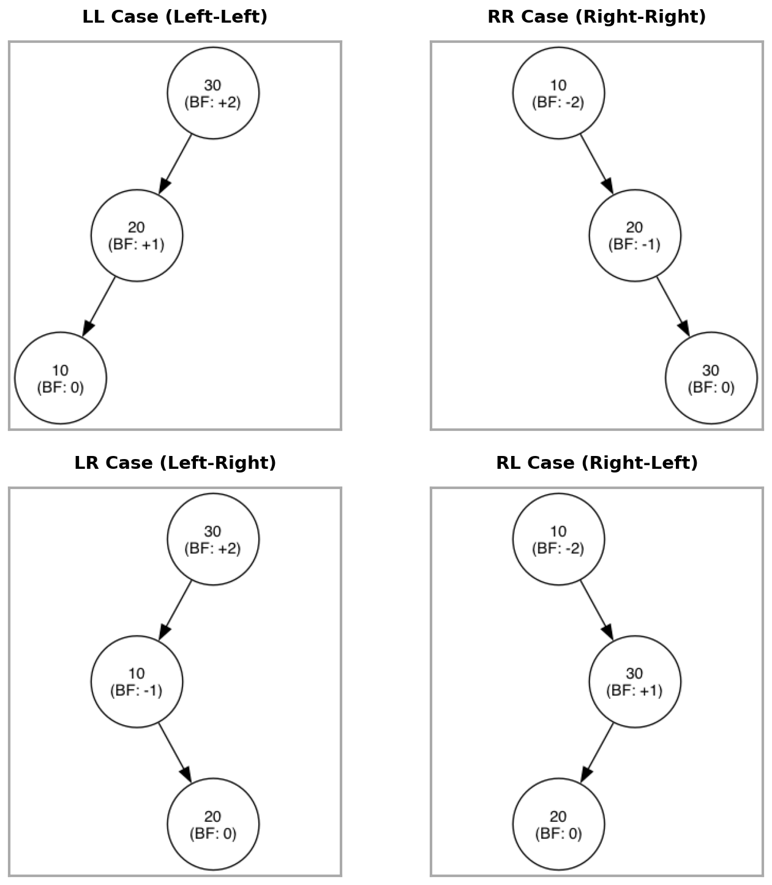

#+title: 자료구조
#+HUGO_BASE_DIR: ~/sangaje.github.io/
#+HUGO_SECTION: posts/Data_Structure
#+HUGO_CATEGORIES: 자료구조
#+HUGO_TAGS: 자료구조
#+HUGO_AUTO_EXPORT: t
#+HUGO_DRAFT: true

* BST-AVL Tree (1) 기초 :Tree:BST:AVL_Tree:
:PROPERTIES:
:EXPORT_FILE_NAME: bst_avl_tree-1
:END:
#+bibliography: ./shared/Reference/Data_Structure/BST.bib

#+BEGIN_QUOTE

#+END_QUOTE

** AVL Tree란?
AVL Tree는 자가 균형 이진 탐색 트리 (self-balancing BST)의 한 종류로, 1962년 G. M. Adel'son-Vel'skii 과 E. M. Landis의 논문에서 처음 소개되었으며[cite:@adelson1962algorithm], AVL Tree의 이름 AVL 은 이 두 사람의 이름에서 따온 것이다. 이는 각 노드의 왼쪽과 오른쪽 서브트리의 높이 차이가 최대 1이 되도록 유지하는 트리 구조로, 삽입과 삭제 연산 후에도 균형을 유지하기 위해 회전 연산을 사용한다. AVL Tree는 균형 조건을 엄격하게 유지하기 때문에 삽입과 탐색 연산이 빠르다. 하지만 해당 연산 시 추가적인 회전 연산이 필요하므로, 구현이 기존의 BST에 비해 다소 복잡하다.

기존의 BST에서는 삽입과 삭제 연산이 트리의 균형을 깨뜨릴 수 있지만, AVL Tree에서는 이러한 연산 후에도 균형을 유지하기 위해 회전 연산이 수행된다. 예를 들어, 노드가 삽입된 후에 균형이 깨진 경우, 단일 회전 또는 이중 회전을 통해 트리를 재구성하여 균형을 회복한다. 이러한 회전은 트리의 높이를 최소화하여 탐색 속도를 유지하는 데 중요한 역할을 한다.

** AVL Tree의 균형 계수
AVL Tree는 각 노드에 균형 계수 (balance factor)를 저장하여, 각 노드의 왼쪽과 오른쪽 서브트리의 높이 차이를 나타낸다. 균형 계수는 -1, 0, 1 중 하나의 값을 가지며, 이 값이 범위를 벗어날 경우 트리가 불균형하다고 판단한다. 삽입이나 삭제 연산 후에 균형 계수가 범위를 벗어나면, 트리를 재구성하여 균형을 회복한다. [[fig:avl_cases]]은 AVL Tree에서 발생할 수 있는 4가지 불균형 케이스 (LL, RR, LR, RL)를 보여주며 이때 균형 계수 $BF$ 는 아래의 식과 같의 정의된다. 그림에서 최 상단 노드의 균형 계수는 +2 또난 -2로, ${-1,0,+1}$ 에 속해있지 않아 불균형하다고 할 수 있다. 사실 그림만 봐도 한쪽으로 쏠려있는 것을 알 수 있지만, 컴퓨터로 연산할 때마다 사람의 눈으로 확인할 수는 없으므로, 균형 계수를 계산하여 불균형 여부를 판단하는 것이다.
\[BF=h(v_{left})-h(v_{right})\]
\[example(LL case): BF_{top}=h(v_{left})-h(v_{right})=2-0=+2\]

#+begin_src python :results output raw :exports results
from graphviz import Digraph
import matplotlib.pyplot as plt
import matplotlib.image as mpimg
import os

def create_avl_case(name, nodes, edges):
    dot = Digraph(name, node_attr={'shape': 'circle', 'width': '0.9', 'fixedsize': 'true', 'fontsize': '11', 'fontname': 'Helvetica'})
    dot.attr(ordering='out')

    for val, bf in nodes.items():
        dot.node(val, f"{val}\n(BF: {bf})")

    children = {val: {'L': None, 'R': None} for val in nodes}
    for p, c, direction in edges:
        children[p][direction] = c

    inv_idx = 0
    for p, child_dict in children.items():
        l_child, r_child = child_dict['L'], child_dict['R']
        if l_child or r_child:
            if l_child: dot.edge(p, l_child)
            else:
                inv_node = f"inv_{inv_idx}"; inv_idx += 1
                dot.node(inv_node, style="invis"); dot.edge(p, inv_node, style="invis")

            inv_mid = f"inv_{inv_idx}"; inv_idx += 1
            dot.node(inv_mid, style="invis", width="0.1", height="0.1"); dot.edge(p, inv_mid, style="invis", weight="10")

            if r_child: dot.edge(p, r_child)
            else:
                inv_node = f"inv_{inv_idx}"; inv_idx += 1
                dot.node(inv_node, style="invis"); dot.edge(p, inv_node, style="invis")

    return dot.render(name, format='png', cleanup=True)

# 1. 4개의 개별 이미지 생성
file_ll = create_avl_case('avl_temp_LL', {'30': '+2', '20': '+1', '10': '0'}, [('30', '20', 'L'), ('20', '10', 'L')])
file_rr = create_avl_case('avl_temp_RR', {'10': '-2', '20': '-1', '30': '0'}, [('10', '20', 'R'), ('20', '30', 'R')])
file_lr = create_avl_case('avl_temp_LR', {'30': '+2', '10': '-1', '20': '0'}, [('30', '10', 'L'), ('10', '20', 'R')])
file_rl = create_avl_case('avl_temp_RL', {'10': '-2', '30': '+1', '20': '0'}, [('10', '30', 'R'), ('30', '20', 'L')])

# 2. Matplotlib으로 2x2 그리드 스케치북 만들기
fig, axs = plt.subplots(2, 2, figsize=(10, 10))

def plot_image(ax, img_path, title):
    img = mpimg.imread(img_path)
    ax.imshow(img)
    ax.set_title(title, fontsize=14, fontweight='bold', pad=15)

    # [수정된 부분] x축, y축 눈금(숫자)은 없애고
    ax.set_xticks([])
    ax.set_yticks([])

    # 테두리(spine)를 살려서 표처럼 보이게 만듭니다.
    for spine in ax.spines.values():
        spine.set_visible(True)
        spine.set_color('#aaaaaa') # 옅은 회색
        spine.set_linewidth(2.0)   # 테두리 두께

plot_image(axs[0, 0], file_ll, "LL Case (Left-Left)")
plot_image(axs[0, 1], file_rr, "RR Case (Right-Right)")
plot_image(axs[1, 0], file_lr, "LR Case (Left-Right)")
plot_image(axs[1, 1], file_rl, "RL Case (Right-Left)")

# 그리드 간격 조정
plt.tight_layout(pad=2.0)
combined_filename = 'avl_all_cases_bordered.png'
plt.savefig(combined_filename, dpi=150, bbox_inches='tight', facecolor='white')
plt.close()

# 3. 임시 개별 파일들 삭제
for f in [file_ll, file_rr, file_lr, file_rl]:
    if os.path.exists(f): os.remove(f)
print(f"[[file:{combined_filename}]]")
#+end_src

#+NAME: fig:avl_cases
#+CAPTION: AVL 트리의 4가지 불균형 케이스 (LL, RR, LR, RL)
#+RESULTS:

#+print_bibliography:
